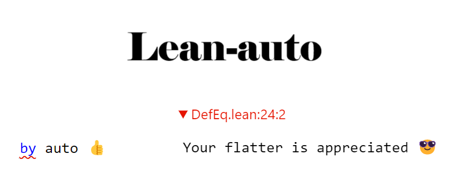

**The above logo is temporary**

Experiments in automation for Lean

## Coding Style
* ``Array``/``List``: In computational code, we only use ``Array``, functions whose signature contains ``List`` should be declared as ``private``. In verification code, we only use ```List```?
* IR: Logic-oriented IR can be found in ```TRanslation/ReifTerm.lean```, and Solver-oriented IR can be found in ```Auto/IR/..```. Each IR should be equipped with its ``TransM``.
* Translation: Translation code from ``A`` to ``B`` should be written in ```Translation/A2B.lean```

## Utilities
* Command ```#getExprAndApply [ <term> | <ident> ]```: Defined in ```ExprExtra.lean```. This command first elaborates the ```<term>``` into a lean ```Expr```, then applies function ```<ident>``` to ```Expr```. The constant ```ident``` must be already declared and be of type ```Expr → TermElabM Unit```
* Command ```#genMonadState <term>, #genMonadContext <term>```: Defined in ```MonadUtils.lean```. Refer to the comment at the beginning of ```MonadUtils.lean```.
* Command ```#fromMetaTactic [<ident>]```: Calls ```Tactic.liftMetaTactic``` on ```<ident>```. The constant ```<ident>``` must be already declared and be of type ```MVarId → MetaM (List MVarId)```
* Lexical Analyzer Generator: ```Parser/LeanLex.lean```. The frontend is not yet implemented. The backend can be found in ```NDFA.lean```.

## Monomorphization Strategy
* Let $H : \alpha$ be an assumption. We require that
  * $(1)$ If the type $\beta$ of any subterm $t$ of $\alpha$ depends on a bound variable $x$ inside $\alpha$, and $\beta$ is not of type $Prop$, then $x$ must be instantiated. Examples: [Monomorphization](./Doc/Monomorphization.lean), section `InstExamples`
  * $(2)$ If any binder $x$ of $\alpha$ has binderinfo `instImplicit`, then the binder $x$ must be instantiated via typeclass inference.
* We define the **skeleton** of an expression $e$, denoted as $\mathsf{skel}(e)$, to be the expression with anything associated with typeclass stripped off
  * For example, ```∀ (a : A) [inst : HAdd A A A], HAdd.hAdd A A A inst a a = HAdd.hAdd A A A inst a a``` becomes ```∀ (a : A), HAdd.hAdd A A A a a = HAdd.hadd A A A a a```
* **Fact 1**: If the type of an ``instImplicit`` forall binder of a user-provided fact depends on a bound variable `x`, then `x` usually occurs in the skeleton of the body.
* **Fact 2**: Non-prop, non-class type constructors usually does not take typeclass instance as arguments.
* Now, we describe an algorithm to check $(1)$. The algorithm is an approximation of what it should be, and the approximation is based on the **Fact 1**. The algorithm runs as follows: Given an assumption $H : \alpha$, do check $(1)$ for $\mathsf{skel}(\alpha)$.

## Translation Workflow (Tentative)
* Collecting assumptions from local context and user-provided facts
  * We reduce ```let``` binders and unfold projections when we collect assumptions. So, in the following discussion, we'll assume that the expression contains no ```let``` binders and no ```proj```s.
  * We also $\beta$ reduce user provided facts so that there are nothing like $(\lambda x. t_1) \ t_2$
* $CIC \to COC$: Collecting constructors and recursors for inductive types (effectively, not directly)
  * e.g collecting equational theorem for *match* constructs
  * e.g collect fields of typeclasses (we probably won't do so because typeclass can get very complicated and there are simply too many fields)
  * e.g collect constructors for inductively defined propositions
* $COC \to COC(\lambda^{c.u.})$: Monomorphization
  * $c.u.$ stands for "constant universe level"
  * Note that at this stage, all the facts we've obtained are still valid $CIC$ expressions and are directly provable from the assumptions.
* $COC(\lambda^{c.u.}) \to COC(\lambda)$
  * We want all types $α$ occuring in the signature of constants and variables to be of sort ```Type (u + 1)```, i.e., $α : Type \ (u + 1)$. This is necessary because we want to write a checker (instead of directly reconstructing proof in DTT) and the valuation function from less expressive logic to dependent type theory requires [the elements in the range of the valuation function] to be [of the same sort].
  * To do this, we use ```GLift```. For example, ```Nat.add``` is transformed into ```Nat.addLift```
    ```lean
    structure GLift.{u, v} (α : Sort u) : Sort (max u (v + 1)) where
      /-- Lift a value into `GLift α` -/    up ::
      /-- Extract a value from `GLift α` -/ down : α

    def Nat.addLift.{u} (x y : GLift.{1, u} Nat) :=
      GLift.up (Nat.add (GLift.down x) (GLift.down y))
    ```
  * We only transfer these "lifted" terms to the less expressive $\lambda_2$, and $\lambda_2$ is unaware of the universe levels wrapped inside ```GLift.up```.
  * Lifted constantes should be introduced into the local context. Theorems corresponding to the original one but using only lifted constants and with uniform universe levels, should also be introduced into the local context. Later translations should only use theorems and constants with uniform universe levels.
* $\lambda \to \lambda(\text{TPTP TF0})$: Instantiating function arguments
  * $\lambda$ is the reified $COC(\lambda)$
* **There should also be a process similar to ULifting that "lifts" Bool into Prop, Nat to Int**

## Reification
* $COC(\lambda) \to \lambda(\text{TPTP\ TH0})$
  * ```Auto/Translation/LamReif.lean```
* $\lambda(\text{TPTP TF0}) \to \text{TPTP TF0}$
  * ```Auto/Translation/LamFOL2SMT.lean```

## Checker
* The checker is based on a deep embedding of simply-typed lambda calculus into dependent type theory.
* The checker is slow on large input assumptions. For example, it takes ``2.5s`` to typecheck the final example in ```Test/Tactics/FirstOrder.lean```, and ```9s``` to typecheck the final example in ```BinderComplexity.lean```. However, this is probably acceptable for mathlib usages, because e.g ```Mathlib/Analysis/BoxIntegral/DivergenceTheorem.lean``` has two theorems that take ```4s``` to compile (but a large portion of the ```4s``` are spent on typeclass inference)